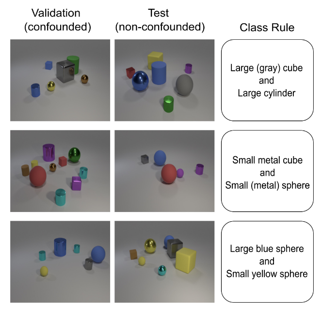
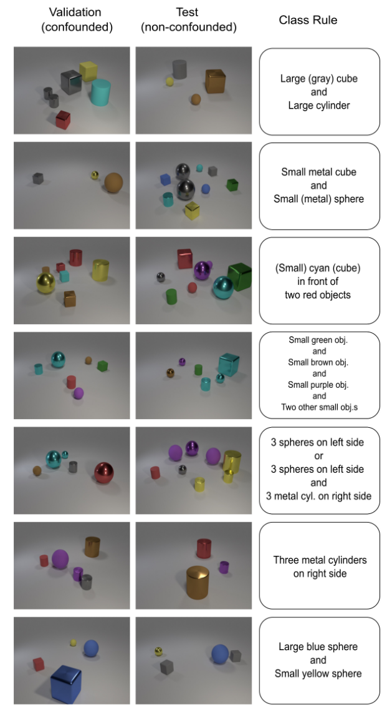

# CLEVR-Hans
Repository for the CLEVR-Hans3 and CLEVR-Hans7 data set introduced in 
[Right for the Right Concept: Revising Neuro-Symbolic Concepts by Interacting with their 
Explanations](https://arxiv.org/pdf/2011.12854.pdf) by Wolfgang Stammer, Patrick Schramowski, 
Kristian Kersting, to be published at CVPR 2021.

## General description
Using the available framework of [CLEVR: A Diagnostic Dataset for
Compositional Language and Elementary Visual Reasoning](https://cs.stanford.edu/people/jcjohns/clevr/) [[1]](#1), 
we have created a confounded data set, which we refer to as the CLEVR-Hans data set. This data set consists of CLEVR 
images divided into several classes. The membership of a class is based on combinations of objects’ attributes and 
relations. Additionally, certain classes within the data set are confounded.  Thus, within the data set, consisting of 
train, validation, and test splits, all train, and validation images of confounded classes will be confounded with a 
specific attribute or combination of attributes.

Each class is represented by 3000 training images, 750 validation images, and 750 test images. The training, validation,
and test set splits contain 9000, 2250, and 2250 samples, respectively, for CLEVR-Hans3 and 21000, 5250, and 5250 
samples for CLEVR-Hans7. The class distribution is balanced for all data splits.

For CLEVR-Hans classes for which class rules contain more than three objects, the number of objects to be placed per 
scene was randomly chosen between the minimal required number of objects for that class and ten, rather than between 
three and ten, as in the original CLEVR data set.

Finally, the images were created such that the exact combinations of the class rules did not occur in images of other 
classes. It is possible that a subset of objects from one class rule occur in an image of another class. However, it 
is not possible that more than one complete class rule is contained in an image.

## Download

#### CLEVR-Hans3 (~ 2.4 GB):

```
wget https://tudatalib.ulb.tu-darmstadt.de/bitstream/handle/tudatalib/2611/CLEVR-Hans3.zip
unzip CLEVR-Hans3.zip
```

#### CLEVR-Hans7 (~ 5.5 GB):

```
wget https://tudatalib.ulb.tu-darmstadt.de/bitstream/handle/tudatalib/2618/CLEVR-Hans7.zip
unzip CLEVR-Hans7.zip
```

## CLEVR-Hans3



CLEVR-Hans3 contains three classes, of which two are confounded. Fig. 4 shows a schematic representation of this data 
set. Images of the first class contain a large cube and large cylinder. The large cube has the color gray in every 
image of the train and validation set. Within the test set, the color of the large cube is shuffled randomly. 
Images of the second class contain a small sphere and small metal cube. The small sphere is made of metal in all 
training and validation set images, however, can be made of either rubber or metal in the test set. Images of the 
third class contain a large blue sphere and a small yellow sphere in all images of the data set. This class is not 
confounded.

## CLEVR-Hans7



The first, second, and seventh class rules of CLEVR-Hans7 correspond to classes one, two, and three of CLEVR-Hans3. 
Images of the third class of CLEVR-Hans7 contain a small cyan object in front of two red objects. 
The cyanobject is a small cube in all images of the training and validation set, yet it can be any shape and size 
within the test set. Images of the fourth class contain at least five small objects. One of these must be green, one 
brown, and one purple. There are no constraints on the remaining small objects. This class is not confounded. 
Images of class five consist of two rules. There are three spheres present in the left half of the image 
(class rule 5a), or there are three spheres present in the left half of the image and three metal cylinders in the right 
half of the image (class rule 5b). Within all data splits, including the test split, class rule5a occurs 90 % of the 
time and class rule 5b 10% of the time. The class rule of the sixth class is contained in class rule 5b, namely three 
metal cylinders in the right half of the image. This is the same for all splits.

## Instructions for generating CLEVR-Hans

The file ```clevr-hans-dataset-gen/image_generation/run_scripts/run_conf_3.sh``` contains the bash script to 
generate CLEVR-Hans3 images as specified by the in-script parameters. 

Important: the class rules are in two separate 
.json files for the non-confounded test set and confounded validation and train set. 

```clevr-hans-dataset-gen/image_generation/data/Clevr_Hans_ConfClasses_3.json``` and 

```clevr-hans-dataset-gen/image_generation/data/Clevr_Hans_GTClasses_3.json``` 

show examples of how to specify these
for CLEVR-Hans3 

(```clevr-hans-dataset-gen/image_generation/data/Clevr_Hans_ConfClasses_7.json``` and
 
```clevr-hans-dataset-gen/image_generation/data/Clevr_Hans_GTClasses_7.json``` 

for the more complicated rules of 
CLEVR-Hans7).

In order to generate your own dataset, please create your own .json files based on the mentioned examples and specify 
the locations of the .json files at the correct parameter name in 

```clevr-hans-dataset-gen/image_generation/run_scripts/run_conf_3.sh```. 

We suggest renaming the files from conf_3 
to your own specification needs.   

Then perform the following steps:

1. ```cd clevr-hans-dataset-gen/docker/```
2. ```docker build -t clevr_hans -f Dockerfile .```
3. ```docker run -it -v /localpathto/clevr-hans-dataset-gen:/home/workspace/clevr-hans-dataset-gen --name clevr_hans --entrypoint='/bin/bash' --user $(id -u):$(id -g) clevr_hans```
4. ```cd ../home/workspace/clevr-hans-dataset-gen/image_generation/```
5. ```./run_scripts/run_conf_3.sh```

The default output location is ```clevr-hans-dataset-gen/output/``` and is specified in the run shell script.

### Note:

Due to compatibility issues with the original CLEVR Blender script and nvidia versions we reverted to creating the 
images on the CPU in parallel processes. This is obviously a sub-optimal hack was the quickest fix. 
Feel free to optimise. 

## References
<a id="1">[1]</a> 
Johnson, J., Hariharan, B., Van Der Maaten, L., Fei-Fei, L., Lawrence Zitnick, C., & Girshick, R. (2017). 
Clevr: A diagnostic dataset for compositional language and elementary visual reasoning. 
In Proceedings of the IEEE Conference on Computer Vision and Pattern Recognition (pp. 2901-2910).

## Citation
If you find this dataset useful in your research, please consider citing:

> @article{stammer2020right,
  title={Right for the Right Concept: Revising Neuro-Symbolic Concepts by Interacting with their Explanations},
  author={Stammer, Wolfgang and Schramowski, Patrick and Kersting, Kristian},
  journal={arXiv preprint arXiv:2011.12854},
  year={2020}
}
